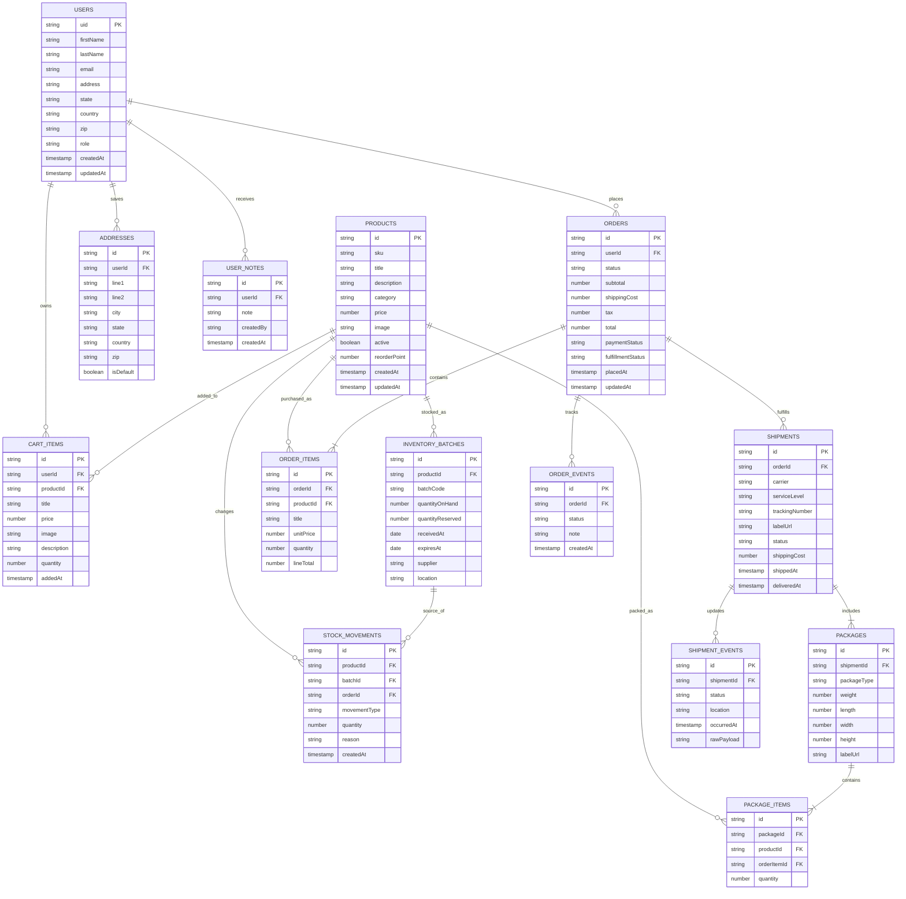

# Firestore Schema ERD

This is a proposed Firestore data model for the current app plus the inventory, packaging, and shipping flow you asked about. The codebase already uses `users/{uid}/cartItems`, so the ERD keeps cart data under each user and separates operational data into its own collections.

## How The Flow Works

1. A customer adds a product to `users/{uid}/cartItems`.
2. Checkout creates an `orders` document and nested `order_items` records.
3. Inventory is reserved with `stock_movements` and `inventory_batches.quantityReserved`.
4. Packing creates `packages` and `package_items`.
5. Shipping creates a `shipments` document and then appends `shipment_events` from the carrier.
6. When the order ships, stock is committed against the source batch and the order status advances.

## Notes

- Keep `products` separate from `inventory_batches` so catalog data and stock data do not fight each other.
- Use `stock_movements` as the audit trail instead of editing quantities directly.
- If you want partial shipments, the `orders` to `shipments` relationship stays one-to-many.
- The existing app-level template and tier config in `src/config/` stay outside Firestore unless you intentionally want them editable in the admin UI.